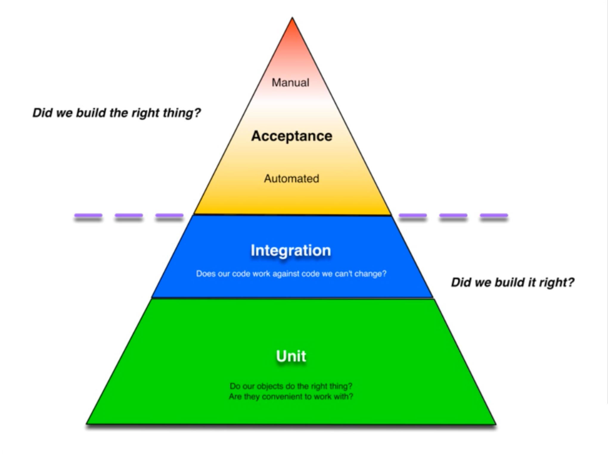

## Testing goals

[Types of tests](https://www.atlassian.com/continuous-delivery/software-testing/types-of-software-testing)

Today, we're going to focus on these three:



I have provded an example e-commerce order management API. It only has a few CRUD endpoints so far. Today we are going to be adding a new endpoint with a focus on how to test it. All tests have been removed from the start folder so that you can work through how to setup all the testing from scratch.

## Step 1: Get the project running

CD into the start directory
Follow the README

## Step 2: Add test for new endpoint

### Background

The new endpoint should be located at /order-stats.
It should return a JSON encoded body that has a key for each day of the week.
The values should be the average of order amounts, in cents, for all orders placed on that day of the week.

Example payload:

```json
{
  "sunday": 1056,
  "monday": 1511,
  "tuesday": 1223,
  "wednesday": 1342,
  "thursday": 1497,
  "friday": 2711,
  "saturday": 1645
}
```

### Create first blank acceptance test

Create an empty test. We'll be using the mocha framework. It is already installed.

`src/order-stats.a-test.ts`

```ts
it("works", () => {});
```

Now we need a way to run our acceptance tests. Add the following to the scripts section of `api/package.json`.

`"test:acceptance": "mocha --require ts-node/register src/**/*.a-test.ts",`

Make sure your project is still running. Run `dev-scripts/start.sh` if it is not.
And now let's run the tests: `npm run test:acceptance`
They should be passing.

### Exepct the endpoint to return JSON encoded data that looks to be about the right shape

Replace your dummy test with the following

`src/order-stats.a-test.ts`

```ts
import { expect } from "chai";
import fetch from "node-fetch";
import config from "./config";

describe("GET /order-stats", () => {
  it("should return a JSON object with days for keys and numbers for values", async () => {
    const response = await fetch(`${config.test.baseUrl}/order-stats`);
    expect(response.status).to.equal(200);
    const stats = await response.json();
    expect(typeof stats.monday).to.equal("number");
  });
});
```

Our test needs to know where to find our API. This way we can run our acceptance tests against remote environments.
Add the following to `config.ts`:

```ts
test: {
  baseUrl: e.BASE_URL || "http://localhost:3000",
},
```

Now run your test. It should fail because you're getting a 404 but you expect a 200.

Take note of what we are checking here and what we are not.
We are checking just enough to tell that the reponse seems to look like order statistics and not some error
response or something else wildly different. Do you think we should verify the payload more specifically?

Opinion: why I suggest verifying little at this layer:

- Because I’d like to be able to run acceptance tests in a fully integrated environment where it will be much harder to control data
- Because I can verify exact values and shape with unit tests

## Step 3: Make your test pass in the most simple way possible

Edit `server.ts` and add this endpoint.

```ts
app.get("/order-stats", async (req: Request, res: Response) => {
  const stats = {
    monday: 1,
  };
  res.send(stats);
});
```

Opinion: Why bother to implement this fake solution?

- To prove that your tests work. Now all you have to do next is refactor!
- Next we are going into lower layers of the testing pyramid (integration and unit). I
  prefer not to have many failing tests at once. It is nice to just work on one broken
  test at a time.

## Step 4: Get the data out of the database

I've already provided `order-repository.ts` so you can follow an established pattern for fetching data from the database. We'll make a new function in
this file to get the stats we need from the database. But first let's start
with a test!

### What type of test do we need?

- Let's walk the pyramid from lightest to heaviest.
- Unit tests
  - We could mock the connection to the database
  - But we could then only verify that we pass the SQL that
    we expect to pass. We cannot verify that the SQL is correct.
- Integration tests
  - Best solution
  - Allows you to verify the correctness of SQL
- Acceptance tests
  - Harder to control data for exact verification of results
  - Mixing with other things being tested at that layer
  - Farther up the test pyramid

So we need an integration test, but we don't have any in our project yet. We're going to have to do some setup.

### Create first dummy test file

Create `order-repository.i-test.ts` with our standard dummy test.

```ts
it("works", () => {});
```

Add the following to package.json so we can run our integration tests.

```json
"test:integration": "mocha --require ts-node/register src/**/*.i-test.ts"
```

Now run your tests with `npm run test:integration`. You should see our single
test passing.

Opinion: Why have separate entrypoints for different types of tests?

- I tend to run tests at the bottom of the pyramid more frequently. For example,
  I often run my unit tests in watch mode all the time that I am coding, but I
  may run acceptance tests only when I finish a chunk of new code.
- You will likely want to run different test types during different phases of your
  build pipeline. You'll likely run unit tests as early as possible, but it is
  common to build and deploy your app somewhere and then run your acceptance tests
  against the environment you just deployed to, which happens much later in your
  build pipeline.

### Enable integration tests to work with the database

This exercise is about testing, not SQL. So I'm just going to provide a known
working query.

Our query is going to return rows that each have a number representing the day of
week and a number representing the average order amount on that day of the week.
Let's create an interface to represent this record.

Add the following to `models.ts`.

```ts
export interface AverageOrderSizeByDayOfWeekStatsRecord {
  averageOrderAmount: number;
  dayOfWeek: number;
}
```

And let's just speed along here and add the whole implementation to make this pass.

Add this function to `order-repository.ts`.

```ts
export async function getAvgOrderAmountByDay(): Promise<
  AverageOrderSizeByDayOfWeekStatsRecord[]
> {
  const results = await pool.query(`
    SELECT
      CAST(ROUND(AVG(amount_cents)) AS INT) AS "averageOrderAmount",
      DATE_PART('dow', created_at) AS "dayOfWeek"
    FROM "order"
    GROUP BY DATE_PART('dow', created_at)
    ORDER BY "dayOfWeek" ASC
  `);
  return results.rows;
}
```

They should be passing! Yay!

But there are two things that feel weird.

1. My tests "hang" for a while at the end before the process exits. What's
   going on?
2. Why did they pass? Where did that data come from and can I trust that
   it will stay that way?

Let's address these one at a time.

### Fix the "hanging" issue

Out tests are hanging at the end because we still have an open connection to the database.
We need to close that connection immediately upon completion of the test suite.

Create `integration-test-setup.ts` with this content.

```ts
import { pool } from "./database-service";

after(() => {
  pool.end();
});
```

Now, tell out test suite to load this file prior to any other test files by changing
our integration test script in `package.json` to the following:

`"test:integration": "mocha --require ts-node/register --file src/integration-test-setup.ts src/**/*.i-test.ts"`

Run the test suite again and it should exit immediately upon completion of the tests.

`npm run test:integration`

### Control our test data

When we ran our query to get average order amounts, we got some non-zero numbers, indicating
that there are already orders in the database. How did they get there?

In this case, the data came from `initdb/02-seed-data.sql`. This file provides enough seed
data for the app to run locally and look normal.

Should we rely on this data in our test suite? Probably not and here's why.

- If you want to add data for other use cases in the future, you're going to have have to
  edit any affected tests. This is an undesirable coupling that will cause you extra work.
- Data could be inserted into this database from other sources such as a human POSTing to
  the `/orders` endpoint to do some manual testing or perhaps another integration test that
  inserts some data.

We should set up our tests to be able to fully control the data instead of relying on data
expected to already be there.

To accomplish this, let's actually use a completely separate database that has no seed data
in it! Then, for each test, we will insert data at the beginning of the test and delete it
at the end of the test.

First, let's create our new database. Add the following to `docker-compose.yaml`.

```yaml
db-test:
  image: postgres:10-alpine
  ports:
    - "5433:5432"
  environment:
    POSTGRES_USER: app
    POSTGRES_PASSWORD: password
    POSTGRES_DB: test
  volumes:
    - /var/lib/postgresql/data
    - "./initdb/01-schema.sql:/docker-entrypoint-initdb.d/01-schema.sql"
```

Note that this looks identical to our other database service definition except that we
are targeting the schema file only instead of the entire initdb direectory that also
contains the seed data.

We're also exposing this database on port 5433 instead of the standard 5432. Let's configure
our app to use this database when running integration tests. If you look at `config.ts`,
you'll see that we can override the postgres port by setting the `POSTGRES_PORT` environment
variable.

Edit `api/package.json` once again to override the port.

`"test:integration": "POSTGRES_PORT=5433 mocha --require ts-node/register --file src/integration-test-setup.ts src/**/*.i-test.ts"`

Bring up the new service by running this from the root of the project (the start folder): `docker-compose up -d`

Now run your tests: `npm run test:integration`

This time they will fail because there is no data in the database.

Now let's insert the data we need and clean it up when we are done by adding these blocks.
In `order-repository.i-test.ts`, put these inside the `describe("#getAvgOrderAmountByDay"` block.

```ts
before(async () => {
  await pool.query(`
    INSERT INTO "order"
    (id, amount_cents, created_at, risk_score)
    VALUES
    ('id-1', 1256, '2020-04-10', 22),
    ('id-2', 5489, '2020-04-02', 12),
    ('id-3', 625, '2020-04-03', 55),
    ('id-3', 1625, '2020-04-05', 66)
  `);
});

after(async () => {
  await pool.query('DELETE FROM "order"');
});
```

You'll also have to import `pool`.

`import { pool } from "./database-service";`

Run your tests again: `npm run test:integration`

They are passing again, only this time you can trust that they will continue to pass
in the future.

## Step 5: Transform the result

The data is coming out of the database as a list of
`AverageOrderSizeByDayOfWeekStatsRecord`s. But remember from the requirements that
we need it to look like this:

```json
{
  "sunday": 1056,
  "monday": 1511,
  "tuesday": 1223,
  "wednesday": 1342,
  "thursday": 1497,
  "friday": 2711,
  "saturday": 1645
}
```

Let's create a model for that. Let's define that interface in `models.ts`.

```ts
export interface AverageOrderSizeByDayOfWeekStatsModel {
  sunday: number;
  monday: number;
  tuesday: number;
  wednesday: number;
  thursday: number;
  friday: number;
  saturday: number;
}
```

And now we need to transform a list of `AverageOrderSizeByDayOfWeekStatsRecord`s to a single
`AverageOrderSizeByDayOfWeekStatsModel`. You might be tempted to do this in
`order-repository.ts`, but don't!

- This is a separate concern (or responsibility) from interacting with the database. SRP
  (single responsibility principle) states that we shouldn't mix these two concerns in a
  single function.
- The test pyramid tells us to favor the bottom of the pyramid. This can easily be tested
  with a unit test. If we add this code to our repository layer, it must be tested with integration tests.

So let's implement this in the aptly named `transforms.ts` file.

But, of course, let's start with a test first.

`transforms.test.ts`

```ts
import { expect } from "chai";

import { AverageOrderSizeByDayOfWeekStatsRecord } from "./models";

import { averageOrderSizeByDayOfWeekRecordsToModel } from "./transforms";

describe("transforms", () => {
  describe("#averageOrderSizeByDayOfWeekRecordsToModel", () => {
    context("when out of order and missing some data", () => {
      it("should map all values correctly and default to 0", () => {});
      const records: AverageOrderSizeByDayOfWeekStatsRecord[] = [
        {
          dayOfWeek: 0,
          averageOrderAmount: 10,
        },
        {
          dayOfWeek: 1,
          averageOrderAmount: 11,
        },
        {
          dayOfWeek: 3,
          averageOrderAmount: 13,
        },
        {
          dayOfWeek: 2,
          averageOrderAmount: 12,
        },
        {
          dayOfWeek: 4,
          averageOrderAmount: 14,
        },
        {
          dayOfWeek: 6,
          averageOrderAmount: 16,
        },
      ];

      const expectedModel = {
        sunday: 10,
        monday: 11,
        tuesday: 12,
        wednesday: 13,
        thursday: 14,
        friday: 0,
        saturday: 16,
      };

      const actualModel = averageOrderSizeByDayOfWeekRecordsToModel(records);

      expect(actualModel).to.eql(expectedModel);
    });
  });
});
```

This is our first unit test. We need to set up a script in `package.json` to run unit
tests.

`"test:unit": "mocha --require ts-node/register src/**/*.test.ts"`

Let's also add a line to make it easy to run these in watch mode, which is a little
more tricky since we're using TypeScript.

`"test:unit:watch": "npm run test:unit -- --watch --watch-files src/**/*.ts"`

And, while we're at it, let's create a shortcut to run all the tests.

`"test": "npm run test:unit && npm run test:integration && npm run test:acceptance"`

Let's run our unit test: `npm run test:unit`

They should fail, complaining that we haven't exported the
`averageOrderSizeByDayOfWeekRecordsToModel` function yet. Let's go define that function
in `transforms.ts`.

```ts
function getAverageOrderAmountForDayOfWeekFromRows(
  dayOfWeek: number,
  rows: any[]
) {
  const row = rows.find((x) => x.dayOfWeek === dayOfWeek);
  return row ? (row.averageOrderAmount as number) : 0;
}

export function averageOrderSizeByDayOfWeekRecordsToModel(
  records: AverageOrderSizeByDayOfWeekStatsRecord[]
): AverageOrderSizeByDayOfWeekStatsModel {
  return {
    sunday: getAverageOrderAmountForDayOfWeekFromRows(0, records),
    monday: getAverageOrderAmountForDayOfWeekFromRows(1, records),
    tuesday: getAverageOrderAmountForDayOfWeekFromRows(2, records),
    wednesday: getAverageOrderAmountForDayOfWeekFromRows(3, records),
    thursday: getAverageOrderAmountForDayOfWeekFromRows(4, records),
    friday: getAverageOrderAmountForDayOfWeekFromRows(5, records),
    saturday: getAverageOrderAmountForDayOfWeekFromRows(6, records),
  };
}
```

You'll have to import `AverageOrderSizeByDayOfWeekStatsRecord` and
`AverageOrderSizeByDayOfWeekStatsModel` from `models.ts`.

Run the unit test again: `npm run test:unit`
They should be passing now.

## Step 6: Put it all together

We could go back to `server.ts` and use our new functions directly there. I recommend
keeping your top-level application logic separate from protocols like HTTP though.
To that end, let's create the following:

`order-service.ts`

```ts
import * as orderRepo from "./order-repository";
import { averageOrderSizeByDayOfWeekRecordsToModel } from "./transforms";

export async function getAvgOrderAmountByDay() {
  const records = await orderRepo.getAvgOrderAmountByDay();
  const model = averageOrderSizeByDayOfWeekRecordsToModel(records);
  return model;
}
```

We left our acceptance tests passing. You can do a quick double check to make sure
they are still passing: `npm run test:acceptance`

Refactor the `/order-stats` route in `server.ts` to use the functions we just created.

```ts
app.get("/order-stats", async (req: Request, res: Response) => {
  const stats = await getAvgOrderAmountByDay();
  res.send(stats);
});
```

You'll have to add this import.

```ts
import { getAvgOrderAmountByDay } from "./order-service";
```

Check that our tests are still passing: `npm run test:acceptance`

## Step 7: Review and debate!

- We didn't write any tests for `order-service.ts`. Should we have?
- We didn't handle any error cases. What important error cases do you think we missed?
- Take a look at a more simple repository function like `getOrderById`. Does it warrant
  an integration test? And how do you feel about that `SELECT *`? Should we be
  specifying columns?
- Take a look back at our overall testing values/goals and the testing pyramid. How
  well do you think we achieved those goals? Would you have approached this differently?
